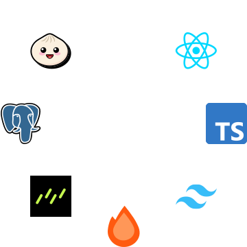

# 👋 Hey, I'm Shubham.

👋 Hey, I'm Shubham Patel, a passionate full-stack developer hailing from India. With a knack for crafting robust and scalable applications, I thrive on building seamless user experiences across the stack.

💻 Armed with expertise in a myriad of full-stack development tools and technologies, I'm always eager to take on new challenges and learn something new along the way. Whether it's front-end frameworks like React.js or Next.j, or diving deep into back-end technologies like Node.js and databases  I'm always up for the task.

🌟 Let's collaborate and build something amazing together! Feel free to explore my repositories and reach out for any exciting projects or opportunities. Cheers!

## 💡 I code using

 

 

## 📊 My stats & more

